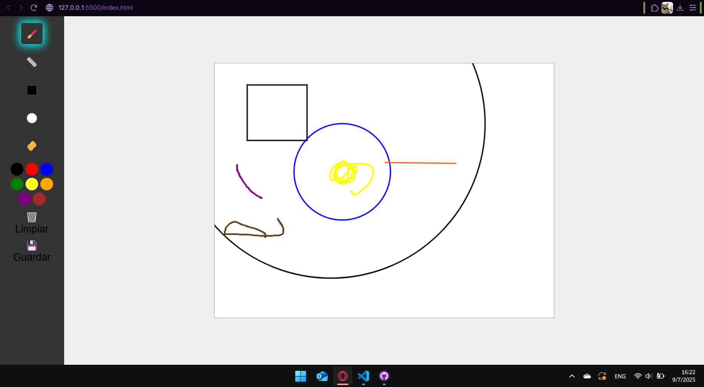
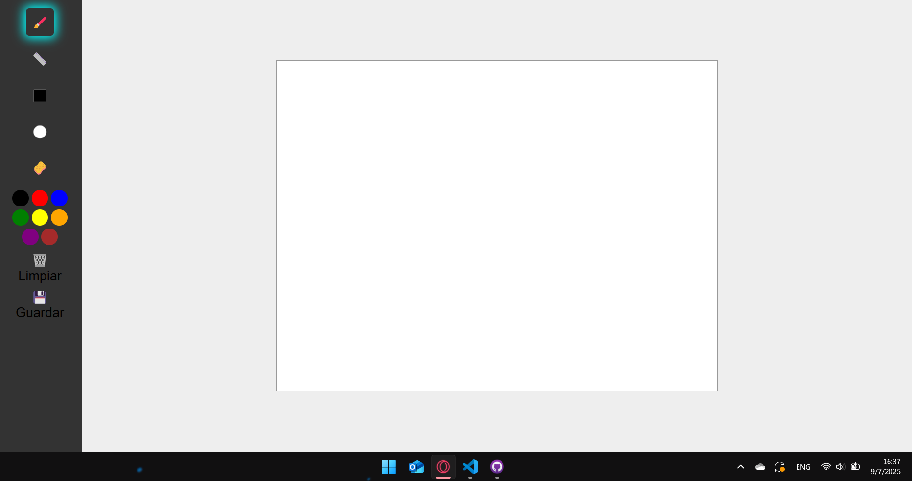

# paint-web

# Captura del funcionamiento de la pagina 

 

## 🛠️ Herramientas implementadas

La barra lateral contiene **5 herramientas de dibujo** con íconos representativos y un feedback visual de selección activa:

| Herramienta           | Icono               | Descripción                                                                  |
| -----------------     |--------             |------------------------------------------------------------------------------|
| **Pincel**            | 🖌️                 | Permite dibujar líneas libres con el color seleccionado. Ideal para bocetos. |
| **Línea recta**       | 📏                 | Dibuja una línea recta entre dos puntos (clic y suelta).                     |
| **Rectángulo**        | ⬛                 | Dibuja un rectángulo entre el punto inicial y final del clic.                |
| **Círculo**           | ⚪                 | Dibuja un círculo basado en la distancia entre el clic y el arrastre.        |
| **Borrador**          | 🧽                 | Borra zonas del dibujo con un trazo blanco grueso (30px).                    |
| **Paleta de colores** | 🔵🟢🟡🟠🟣🟤🟥⚫| Posee colores de azul, verde, amarillo, naranja, morado, cafe, rojo y negro  |
------------------------------------------------------------------------------------------------------------

---

## 🧾 Instrucciones de uso

1. **Abrir** el archivo `index.html` en cualquier navegador moderno.
2. **Seleccionar una herramienta** de la barra lateral (se activa con efecto visual).
3. **Elegir un color** en la paleta de colores.
4. **Dibujar** en el canvas blanco (800x600px) con el mouse.
5. Opcionalmente:
   - Usar 🗑️ **Limpiar** para borrar todo el dibujo.
   - Usar 💾 **Guardar** para descargar el dibujo como imagen PNG.

---
